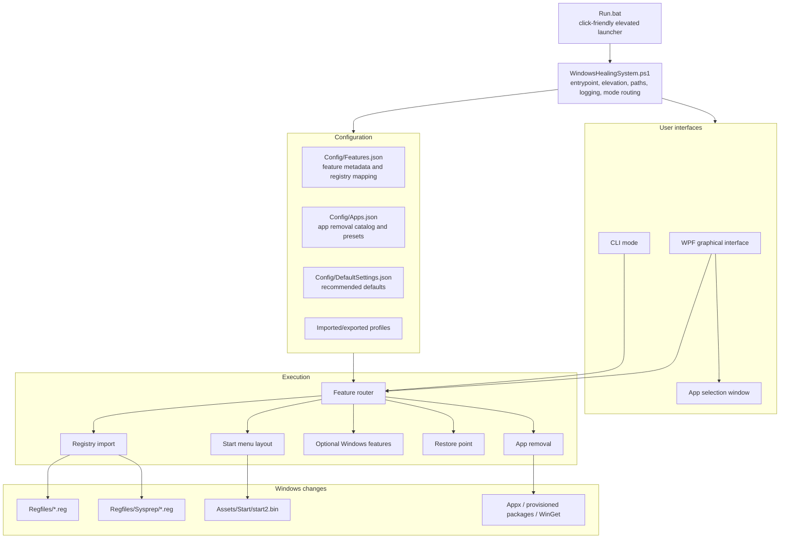
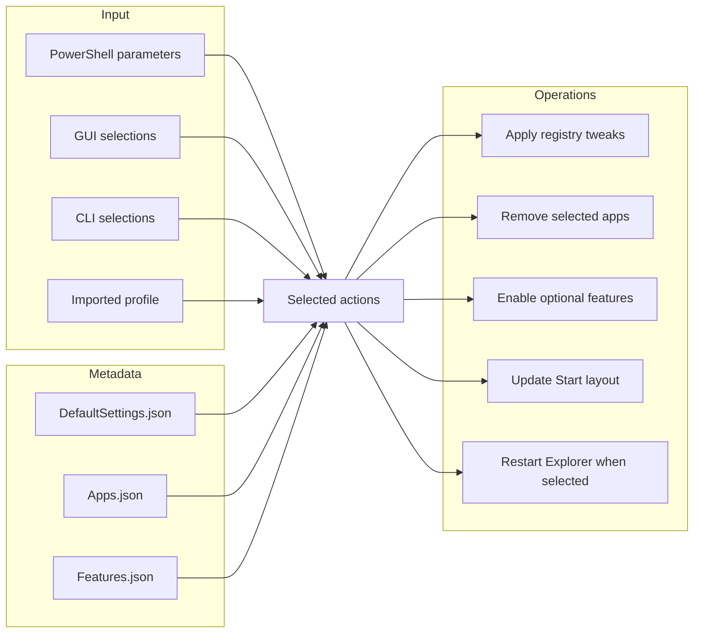
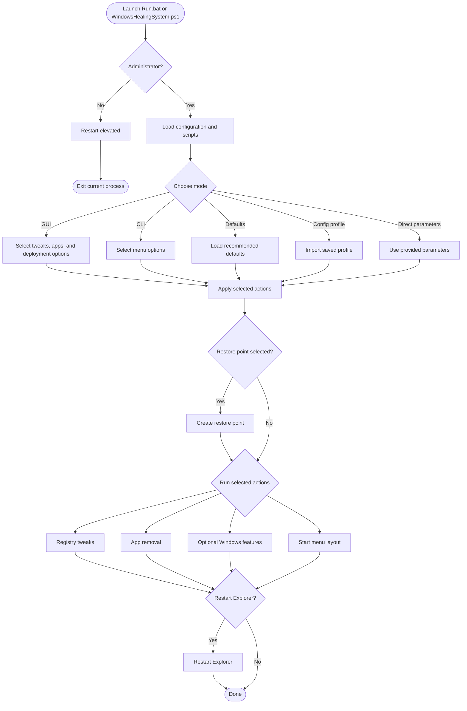

# Windows Healing System

Windows Healing System is a Windows 11 optimization and cleanup utility built with PowerShell and WPF. It gives users a single, auditable interface for applying privacy settings, removing unwanted apps, adjusting Windows UI behavior, configuring File Explorer and taskbar options, and preparing repeatable system profiles.

Repository: https://github.com/X-37th/Windows-Healing-System.git

Current script version: `2026.06.25`

## Features

- Graphical Windows interface for selecting system tweaks and removable apps.
- CLI mode for terminal-based use and repeatable execution.
- Registry-backed Windows tweaks stored as readable `.reg` files.
- App removal using Appx, provisioned package removal, and WinGet-supported paths.
- Optional restore point creation before applying changes.
- Import and export support for reusable configuration profiles.
- Sysprep/default-user support for preparing settings for newly created Windows users.
- Runtime logging for troubleshooting.

## Requirements

- Windows 11.
- PowerShell 5.1 or newer.
- Administrator permissions.
- Full PowerShell language mode.
- WinGet recommended for OneDrive and Edge removal paths.
- WPF-capable desktop session for the graphical interface.

If the graphical interface cannot load, Windows Healing System falls back to CLI mode. Sysprep mode is supported only on Windows 11.

## Installation

Clone the repository:

```powershell
git clone https://github.com/X-37th/Windows-Healing-System.git
cd Windows-Healing-System
```

## Launch Options

Windows Healing System has two entry points:

- `Run.bat` is the click-friendly launcher. It opens an elevated terminal, prefers Windows Terminal when available, falls back to Windows PowerShell, and writes launcher output to `Logs/WindowsHealingSystem-Run.log`.
- `WindowsHealingSystem.ps1` is the main application script. It performs elevation checks, loads configuration, opens the GUI or CLI, applies selected actions, and writes the main transcript log to `Logs/WindowsHealingSystem.log`.

Use `Run.bat` when you want the simplest launch path:

```powershell
.\Run.bat
```

Use `WindowsHealingSystem.ps1` directly when you want CLI flags, automation, imported profiles, or deployment options:

```powershell
powershell -NoProfile -ExecutionPolicy Bypass -File .\WindowsHealingSystem.ps1
```

If the tool is not running as Administrator, it prompts to restart elevated and forwards the arguments you provided.

## Usage

Open the graphical interface:

```powershell
powershell -NoProfile -ExecutionPolicy Bypass -File .\WindowsHealingSystem.ps1
```

Open CLI mode:

```powershell
powershell -NoProfile -ExecutionPolicy Bypass -File .\WindowsHealingSystem.ps1 -CLI
```

Apply recommended defaults:

```powershell
powershell -NoProfile -ExecutionPolicy Bypass -File .\WindowsHealingSystem.ps1 -RunDefaults
```

Apply recommended defaults without default app removal:

```powershell
powershell -NoProfile -ExecutionPolicy Bypass -File .\WindowsHealingSystem.ps1 -RunDefaultsLite
```

Open the custom app list generator:

```powershell
powershell -NoProfile -ExecutionPolicy Bypass -File .\WindowsHealingSystem.ps1 -RunAppsListGenerator
```

Remove apps from the default removal list:

```powershell
powershell -NoProfile -ExecutionPolicy Bypass -File .\WindowsHealingSystem.ps1 -RemoveApps -Apps Default
```

Remove specific apps by package ID:

```powershell
powershell -NoProfile -ExecutionPolicy Bypass -File .\WindowsHealingSystem.ps1 -RemoveApps -Apps "Microsoft.BingWeather,Microsoft.XboxGamingOverlay"
```

Apply an exported configuration profile:

```powershell
powershell -NoProfile -ExecutionPolicy Bypass -File .\WindowsHealingSystem.ps1 -Config .\WindowsHealingSystem-Config-20260624.json
```

Write logs to an existing custom folder:

```powershell
powershell -NoProfile -ExecutionPolicy Bypass -File .\WindowsHealingSystem.ps1 -LogPath C:\Temp
```

## Deployment Options

Apply supported registry changes to a specific user hive:

```powershell
powershell -NoProfile -ExecutionPolicy Bypass -File .\WindowsHealingSystem.ps1 -CLI -User Alice -DisableTelemetry
```

Apply supported registry changes to the default user profile for newly created users:

```powershell
powershell -NoProfile -ExecutionPolicy Bypass -File .\WindowsHealingSystem.ps1 -CLI -Sysprep -DisableTelemetry -DisableSuggestions
```

Control app removal scope:

```powershell
powershell -NoProfile -ExecutionPolicy Bypass -File .\WindowsHealingSystem.ps1 -RemoveApps -Apps Default -AppRemovalTarget CurrentUser
```

Supported app removal targets are `AllUsers`, `CurrentUser`, or a specific Windows username.

## Configuration Profiles

Windows Healing System can import and export reusable configuration profiles. A profile can include:

- `Apps`: app package IDs selected for removal.
- `Tweaks`: Windows settings selected for application.
- `Deployment`: execution options such as restore point, restart Explorer behavior, target user, or Sysprep mode.

Use the graphical interface to export a profile, then apply it later with:

```powershell
powershell -NoProfile -ExecutionPolicy Bypass -File .\WindowsHealingSystem.ps1 -Config .\WindowsHealingSystem-Config-20260624.json
```

## How It Works

The diagrams below are written as Mermaid blocks. GitHub renders Mermaid diagrams automatically in Markdown, so they appear as visual diagrams on the repository page instead of plain code blocks.

### System Architecture



### Configuration Flow



### Runtime Flow



## Logs

Windows Healing System creates local logs while it runs:

- `Logs/WindowsHealingSystem.log`
- `Logs/WindowsHealingSystem-Run.log`

These logs are for troubleshooting and are not required to run the project.

## Disclaimer

Windows Healing System changes Windows configuration and can remove built-in applications. Review the selected actions before applying them and test changes before using them on important systems.
